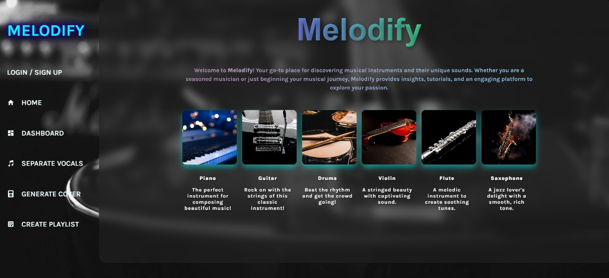

# 🎶 Melodify - AI-Powered Instrumental Cover Generator

**Melodify** is an AI-powered web application that transforms vocal tracks into instrumental covers. Built for music learners and enthusiasts, it allows users to extract vocals, generate instrument-specific covers, and customize tracks.

🎯 Designed and developed by **Team CodeHarmony** for Inheritance 2024.

## 🚀 Features

- 🎵 Vocal & instrumental separation using Spleeter
- 🧑‍🎤 Generate covers in instruments like violin, flute, piano, etc. via DDSP
- 💾 Download processed audio files
- 📊 Dashboard with:
  - Previous conversions history  
  - Instrument usage pie chart
- 🎧 Create and manage custom playlists of generated covers 
- 📁 Clean and intuitive UI

## 🛠️ Tech Stack

**Frontend**: React, Tailwind CSS  
**Backend**: Node.js, Express  
**Machine Learning**: Spleeter, DDSP  
**Other Tools**: Python, Git, GitHub

## 🧑‍💻 Usage

- Upload your song (.mp3/.wav).
- View the original song.
- Choose an instrument for the cover.
- Get the generated desired instrumental track.
- Download the final instrumental track.

## 📺 Demo
[Melodify Demo](melodify_demo_video.mp4)

## 🔮 Future Scope

- 🎚️ Control pitch, tempo, and effects of generated tracks
- 🧩 Combine multiple tracks to create layered music
- 🧠 Support more instruments via trained DDSP models
- 📦 Host on cloud with scalable audio processing
- 🎤 Real-time karaoke mode
